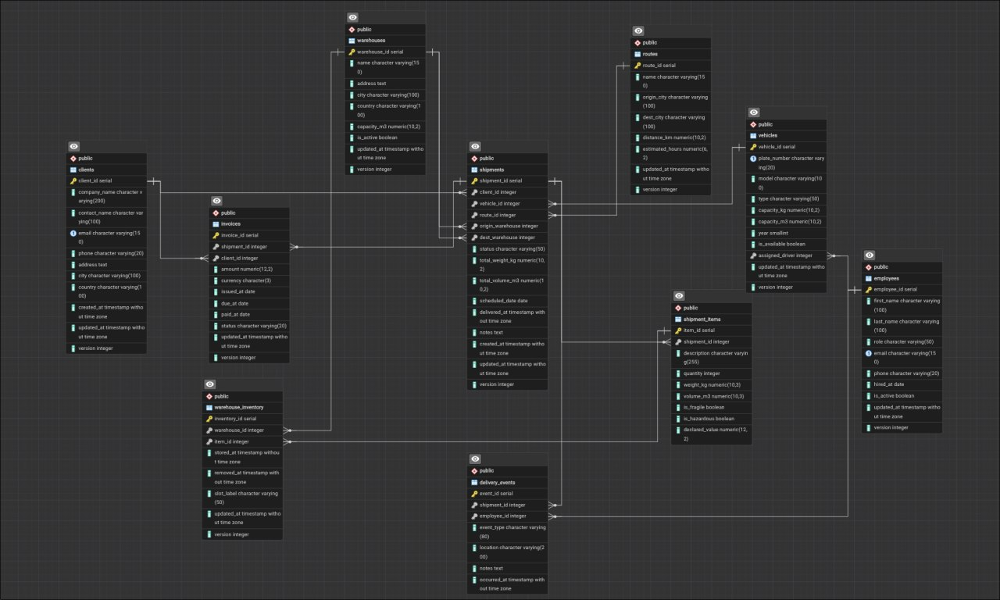

## Intro

This is a database and DWH for logistics company in Kazakhstan. For further information read core_info section or core_info.docs.

## How to use

To set project up you need to run `docker compose up`. This will:
- Up posgress and pg admin
- Create entire original schema and DWH schema
- Load all csv files form the csv_data folder to the database
- Run the migration script

And that's it.

If you want to clear everything and restart then do:
- `docker compose down -v` 
- `docker compose up -d`
Or if you already down then before up do `docker volume rm postgres_data` and `docker volume rm pgadmin_data`.

If for some reason you want to regenerate the data files then run `python3 generate_data.py`.
This will regenerate all files in the csv_data folder.

# Logistics DWH — Core Info

## 1. OLTP Database (`public` schema)

### Business entities

| Table | What it stores |
|-------|---------------|
| `clients` | Companies that order shipments - contact info, city/country |
| `warehouses` | Physical warehouse locations with storage capacity |
| `employees` | Staff - drivers, managers, dispatchers, warehouse workers |
| `vehicles` | Fleet - trucks, vans, motorcycles, trailers; each optionally assigned to a driver |
| `routes` | Named origin->destination corridors with distance and estimated travel time |
| `shipments` | A single delivery order: client, vehicle, route, warehouses, status, weight/volume |
| `shipment_items` | Line items inside a shipment - quantity, weight, fragility, declared value |
| `delivery_events` | Audit trail of every status change a shipment goes through, logged by an employee |
| `invoices` | Billing document per shipment - amount in KZT, issue/due/paid dates, payment status |
| `warehouse_inventory` | Which shipment item is currently stored in which warehouse slot |

### Key constraints & rules

- **PKs:** all tables use `SERIAL` surrogate PKs.
- **Unique:** `clients.email`, `employees.email`, `vehicles.plate_number`.
- **FKs:**
  - `vehicles.assigned_driver -> employees.employee_id` (SET NULL on delete)
  - `shipments -> clients`, `vehicles`, `routes`, `warehouses` (origin + dest)
  - `shipment_items -> shipments` (CASCADE delete)
  - `delivery_events -> shipments` (CASCADE), `employees` (SET NULL)
  - `invoices -> shipments`, `clients` (RESTRICT delete)
  - `warehouse_inventory -> warehouses`, `shipment_items` (CASCADE); UNIQUE(warehouse_id, item_id)
- **CHECK constraints:**
  - `employees.role IN ('driver','manager','dispatcher','warehouse_worker')`
  - `vehicles.type IN ('truck','van','motorcycle','trailer')`
  - `shipments.status IN ('pending','in_transit','delivered','cancelled','returned')`
  - `invoices.status IN ('unpaid','paid','overdue','cancelled')`
  - `delivery_events.event_type IN ('created','picked_up','arrived_warehouse','departed_warehouse','out_for_delivery','delivered','failed_attempt','returned','cancelled')`
- **Optimistic locking:** every mutable table has a `version` column and `updated_at`. A `BEFORE UPDATE` trigger (`trg_bump_version`) increments `version` and stamps `updated_at` automatically.

---

## 2. OLAP Database (`dwh` schema)

### Analytical questions it answers

**Shipment performance**
- How many shipments were delivered on time vs. late, by month/quarter/year?
- What is the average days-in-transit per route? Per vehicle type?
- Which routes have the highest cancellation or return rate?
- How does shipment volume (weight, count) trend over time?

**Client analytics**
- Who are the top clients by shipment count and declared cargo value?
- Which clients have the most overdue invoices?
- How has a client's shipment frequency changed over time (SCD2 tracks historical state)?

**Financial analytics**
- What is total revenue by month, quarter, year?
- Average days-to-pay per client? Per invoice status?
- What is the total overdue amount outstanding right now?
- Which shipments are generating invoices that go overdue most often?

---

## 3. DWH Schema: Tables, Keys & Relations

### Static lookup dimensions (seeded once, never truncated on reload)

| Table | PK | Key columns | Notes |
|-------|----|-------------|-------|
| `dim_date` | `date_key` (INT, YYYYMMDD) | `full_date` UNIQUE, `year`, `quarter`, `month_num`, `week_of_year`, `day_of_week`, `is_weekend`, `is_holiday` | covers 2020-01-01 -> 2030-12-31 |
| `dim_status` | `status_key` SERIAL | `domain` ('shipment'\|'invoice'), `status_name`; UNIQUE(domain, status_name) | - |
| `dim_vehicle_type` | `vehicle_type_key` SERIAL | `type_name` UNIQUE | - |
| `dim_employee_role` | `role_key` SERIAL | `role_name` UNIQUE | - |

### OLTP-derived dimensions (truncated + reloaded on each migration run)

| Table | PK | Natural key | FK references | Notes |
|-------|----|-------------|---------------|-------|
| `dim_geography` | `geography_key` | UNIQUE(city, country) | - | Union of all city/country pairs from clients, warehouses, routes |
| `dim_client` | `client_key` | `client_id` + `is_current` | `geography_key -> dim_geography` | **SCD Type 2** - `valid_from`, `valid_to`, `is_current`, `scd_version`; initial load creates one current row per client |
| `dim_warehouse` | `warehouse_key` | - | `geography_key -> dim_geography` | - |
| `dim_vehicle` | `vehicle_key` | - | `vehicle_type_key -> dim_vehicle_type` | - |
| `dim_employee` | `employee_key` | - | `role_key -> dim_employee_role` | - |
| `dim_route` | `route_key` | - | `origin_geography_key`, `dest_geography_key -> dim_geography` | - |

### Fact tables

| Table | PK | Grain | Measures | FK references |
|-------|----|-------|----------|---------------|
| `fact_shipments` | `shipment_fact_id` | One row per shipment | `total_weight_kg`, `total_volume_m3`, `item_count`, `declared_value_total`, `distance_km`, `days_in_transit` | `client_key`, `vehicle_key`, `route_key`, `origin_warehouse_key`, `dest_warehouse_key`, `status_key`, `scheduled_date_key`, `delivered_date_key` |
| `fact_invoices` | `invoice_fact_id` | One row per invoice | `amount`, `days_to_pay`, `days_overdue` | `client_key`, `status_key`, `issued_date_key`, `due_date_key`, `paid_date_key` |

### Bridge table

| Table | PK | Purpose |
|-------|----|---------|
| `bridge_shipment_employees` | (`shipment_fact_id`, `employee_key`, `role_key`) | Resolves M:N between shipments and employees. `event_count` is how many delivery events that employee logged for that shipment. |

### Migration error log

| Table | Key columns |
|-------|-------------|
| `migration_errors` | `run_id` UUID groups all errors from one `migrate_oltp_to_dwh()` call. |

### Entity-relation summary

### Data transformation im Power BI

- All cities in dim_geography transformed to uppercase.
- Added calculatable column overdue_category.
- Added hierarchies for geography and calendsr.
- 
